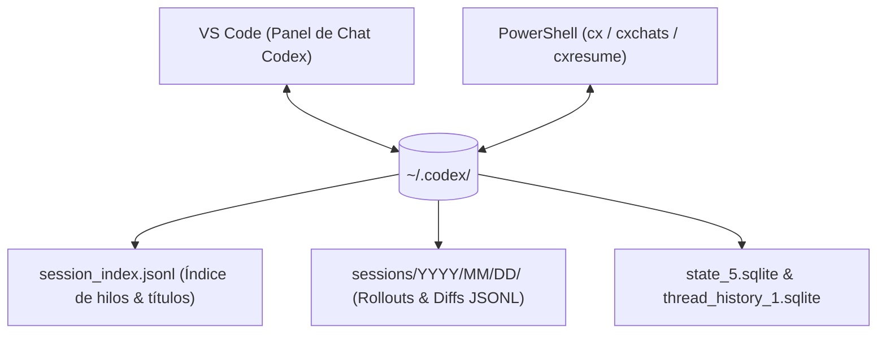

# Guía de Integración: OpenAI Codex CLI y VS Code

Este documento describe la integración nativa entre **OpenAI Codex CLI** y el perfil modular de Windows PowerShell 5.1 (`profile.d/26-codex.ps1`), así como la interoperabilidad bidireccional de conversaciones con la extensión oficial de **Visual Studio Code**.

---

## 1. Arquitectura y Descubrimiento Dinámico

OpenAI Codex no requiere una instalación independiente si ya utilizas la extensión oficial de VS Code (*Codex – OpenAI’s coding agent*, identificador `openai.chatgpt`).

### ¿Cómo localiza PowerShell el ejecutable?
La función `Get-CodexExe` implementa una estrategia de resolución en cascada sin rutas fijas (*zero hardcoding*):
1. **Caché en memoria**: Una vez resuelto durante la sesión, no incurre en lecturas adicionales de disco.
2. **Variable de entorno personalizada**: Respeta `$env:CODEX_EXE` si el usuario desea forzar un binario específico.
3. **PATH del sistema**: Comprueba si `codex.exe` ya está registrado globalmente.
4. **Detección dinámica en VS Code**: Examina `~/.vscode/extensions/openai.chatgpt-*-win32-x64/bin/windows-x86_64/codex.exe`, seleccionando automáticamente la versión más reciente en caso de múltiples actualizaciones.

Al iniciar PowerShell, el directorio del binario se añade dinámicamente al `$env:PATH` del proceso actual, permitiendo que tanto tus terminales como cualquier subproceso (incluido Antigravity CLI) puedan invocar `codex` directamente.

---

## 2. Persistencia y Almacenamiento Compartido (`~/.codex`)

Tanto VS Code como la CLI interactiva operan sobre el mismo almacén local en `$HOME\.codex`:



- **`session_index.jsonl`**: Mapea en tiempo real cada conversación con su `id` (UUID), su `thread_name` (el título que se muestra en el panel de VS Code) y la fecha de última modificación (`updated_at`).
- **`sessions/`**: Almacena los volcados de eventos, parches de código propuestos y respuestas de cada turno.
- **Autenticación unificada**: Las credenciales de suscripción ChatGPT (`auth.json`) se comparten entre ambas interfaces sin necesidad de reautenticarse en la consola.

---

## 3. Tabla de Comandos y Atajos Rápidos

| Comando Principal | Alias Rápidos | Descripción | Ejemplo de Uso |
| :--- | :--- | :--- | :--- |
| `codex` | `cx` | Invoca la TUI interactiva de Codex o subcomandos | `cx`, `cx "Refactoriza este método"` |
| `codex-history` | `cxchats`, `cx-chats` | Historial cronológico inverso de hilos de VS Code y CLI | `cxchats`, `cxchats 15`, `cxchats 10 "Adobe"` |
| `codex-resume` | `cxresume`, `codex-c` | Reanuda una conversación por índice `[1]`, UUID o menú `fzf` | `cxresume 1`, `cxresume 01a0fc19`, `cxresume` |
| `codex-review` | `cxreview` | Auditoría de código automatizada no interactiva sobre el repo Git | `cxreview` |
| `codex-apply` | `cxapply` | Aplica el diff más reciente propuesto por Codex con `git apply` | `cxapply` |
| `codex-exec` | `cxexec` | Ejecución no interactiva en segundo plano | `cxexec "Genera script de backup"`, `cxexec -Json "..."` |
| `codex-radar` | `cxradar`, `cxstatus` | Monitor y digest en tiempo real de agentes activos (multi-agente) | `cxradar`, `cxradar 5`, `cxradar -Json`, `cxradar -Full` |
| `codex-doctor` | `cxdoctor` | Diagnóstico de salud, auth, conectividad y base de datos | `cxdoctor` |

---

## 4. Flujos de Trabajo Recomendados

### Flujo A: Continuar en la Terminal lo que iniciaste en VS Code
1. Estás trabajando en VS Code y mantienes una conversación con Codex.
2. Al abrir PowerShell, ejecutas `cxchats` para ver tus hilos recientes:
   ```text
   === Historial de Conversaciones de Codex (5) ===

    [1]  2026-10-02 12:12  01a0fc19...  Eliminar acuerdo Adobe del flujo
    [2]  2026-10-01 14:53  01a0f786...  Revisar cambio de características
    [3]  2026-10-01 13:13  01a0f72b...  Guardian review
   ```
3. Ejecutas `cxresume 1` (o `cxresume` con `fzf` para seleccionar interactivamente):
   Codex se abre de inmediato en la terminal con todo el contexto, historial y archivos del hilo original.

### Flujo B: Revisión de Código Exprés antes de un Commit
1. Has realizado modificaciones locales en tu repositorio Git.
2. Compruebas tu estado con `gs` y ejecutas:
   ```powershell
   cxreview
   ```
3. Codex analiza los cambios del repositorio y emite un informe estructurado de mejoras, bugs potenciales y sugerencias.
4. Si Codex generó sugerencias en un archivo diff, puedes consolidarlas en tu árbol de trabajo con:
   ```powershell
   cxapply
   ```

### Flujo C: Diagnóstico y Verificación del Entorno
Si experimentas problemas de conexión o quieres revisar el estado de tus bases de datos SQLite locales:
```powershell
cxdoctor
```
Muestra un reporte completo de autenticación, integridad de bases de datos de rollouts, modelos activos y estado del sandbox.

### Flujo D: Supervisión Multi-Agente (Codex Radar)
Cuando tienes múltiples ventanas de VS Code con agentes Codex trabajando simultáneamente:
```powershell
cxradar          # Resumen ejecutivo de los 3 agentes más recientes
cxradar 5        # Resumir los 5 agentes más recientes
cxradar -Full    # Ver respuestas completas sin truncar
cxradar -Json    # Salida JSON estructurada para integración con Antigravity u orquestadores
```
Muestra de forma instantánea y no bloqueante el estado (Completado / En progreso), tokens consumidos y las últimas respuestas de cada agente sin necesidad de saltar entre ventanas de VS Code.

